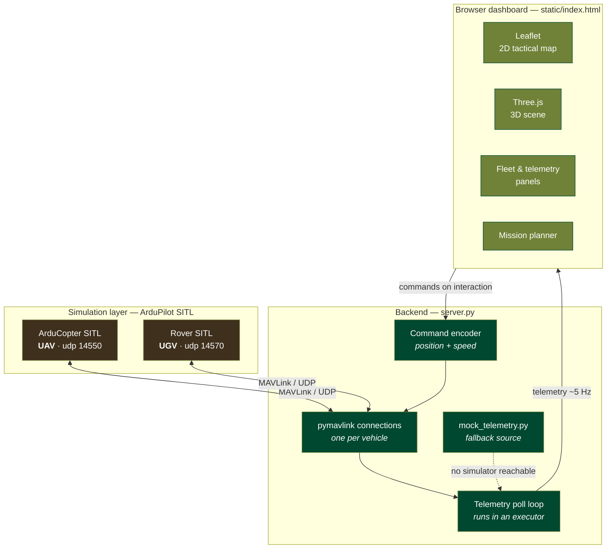
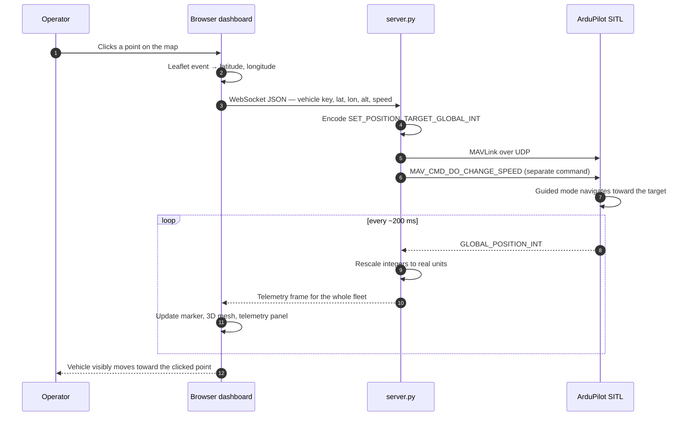
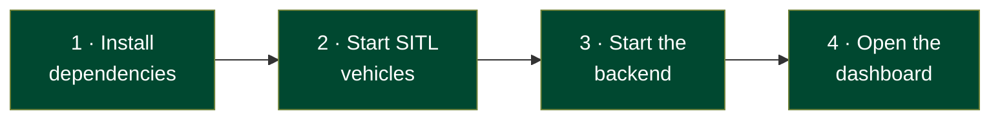

<div align="center">

# Stratum GCS

**A browser-based command-and-control dashboard for simulated UAVs and UGVs, speaking real MAVLink.**

[](https://python.org)
[](https://fastapi.tiangolo.com)
[](https://mavlink.io)
[](https://ardupilot.org)
[](https://threejs.org)
[](https://leafletjs.com)

<br>

`Simulated vehicles` → `MAVLink / UDP` → `Python backend` → `WebSocket` → `Live browser dashboard` → `and back again`

</div>

---

## Contents

| | |
|:---|:---|
| [What this is](#what-this-is) | The project in one paragraph |
| [Background](#background-the-five-ideas-you-need) | The five concepts the project is built on |
| [Architecture](#architecture) | How the pieces fit together |
| [How a click becomes a command](#how-a-click-becomes-a-command) | The full round trip, step by step |
| [Features](#features) | What the dashboard can do |
| [Tech stack](#tech-stack) | What each layer is, and why |
| [MAVLink details](#mavlink-details) | The protocol work, with code |
| [Project structure](#project-structure) | Where everything lives |
| [Running it](#running-it) | Setup from a clean machine |
| [Using it](#using-it) | Controls reference |
| [What I learned](#what-i-learned) | The bugs worth remembering |
| [Scope and honesty](#scope-and-honesty) | What is real and what is not |
| [Possible next steps](#possible-next-steps) | Roadmap |

---

## What this is

Stratum GCS is a **ground control station** — the kind of software an operator uses to watch a fleet of drones or ground robots on a map and tell them where to go. This one is a hobby project, built to understand that pipeline from end to end rather than to ship a product.

The question that started it:

> *How does a click on a map turn into a real command a flight controller understands? And how does a vehicle's position get from its GPS, through a radio protocol, into a browser, in real time?*

So the whole path is built here: simulated vehicles running genuine autopilot firmware, talking real MAVLink over UDP, into a Python backend, out over a WebSocket, into a live browser dashboard — and commands flowing back the other way down the same pipe.

**Nothing here wraps an existing GCS.** The MAVLink handling, telemetry streaming, command encoding, and the entire interface are written from scratch. That was the entire point.

---

## Background: the five ideas you need

If you've never touched drone software, these are the only concepts required to follow the rest of this README.

<table>
<tr>
<td width="22%" valign="top"><b>Flight controller</b></td>
<td valign="top">The small computer on board a vehicle that actually flies or drives it. It runs autopilot firmware — here, <b>ArduPilot</b> — which handles stabilisation, navigation and safety. A GCS never controls motors directly; it sends intent, and the flight controller works out the rest.</td>
</tr>
<tr>
<td valign="top"><b>MAVLink</b></td>
<td valign="top">The messaging protocol that vehicles and ground stations speak to each other. It is deliberately tiny — messages are packed binary structs, sized to survive a low-bandwidth radio link. It is the industry standard, not a custom format invented for this project.</td>
</tr>
<tr>
<td valign="top"><b>SITL</b></td>
<td valign="top"><i>Software In The Loop.</i> ArduPilot compiled to run on a laptop instead of on a flight board, with a physics model standing in for the real world. It is the <b>same firmware and the same guidance logic</b> as real hardware — so the messages it accepts are the messages a real vehicle accepts.</td>
</tr>
<tr>
<td valign="top"><b>Guided mode</b></td>
<td valign="top">A flight mode where the vehicle waits for a ground station to hand it a target position, then navigates there on its own. This is what makes click-to-command possible: the GCS only says <i>go here</i>, never <i>turn left now</i>.</td>
</tr>
<tr>
<td valign="top"><b>UAV vs UGV</b></td>
<td valign="top">Unmanned <i>aerial</i> vehicle (a drone) and unmanned <i>ground</i> vehicle (a rover). Stratum supports both, and — as it turns out — mostly with the same code.</td>
</tr>
</table>

---

## Architecture



**One WebSocket, two directions of traffic:**

| Direction | Payload | Rate |
|:---|:---|:---|
| Server → Browser | Telemetry for every vehicle | ~5 Hz |
| Browser → Server | Waypoint and speed commands | On interaction |

A single persistent connection carries both. There is no polling, and no second channel to keep in sync.

---

## How a click becomes a command

This is the round trip the whole project exists to demonstrate.



The important part is step 4 onward: the browser never says *how* to get there. It names a destination, and the vehicle's own firmware decides what that means for its frame type.

---

## Features

<table>
<tr>
<td width="50%" valign="top">

### Live telemetry
Position, altitude, speed, heading and battery from every connected vehicle, streamed several times a second over a persistent WebSocket.

</td>
<td width="50%" valign="top">

### Click-to-command
Click anywhere on the map to send a real guided-mode waypoint to the selected vehicle. It actually flies or drives there.

</td>
</tr>
<tr>
<td width="50%" valign="top">

### UAV and UGV support
Toggle between aerial drones and ground rovers. The interface adapts — rovers lose altitude control, markers change shape, labels update.

</td>
<td width="50%" valign="top">

### Multi-waypoint missions
Plan up to **15 sequential waypoints** per vehicle, then execute the whole route. Each vehicle holds its own independent mission.

</td>
</tr>
<tr>
<td width="50%" valign="top">

### Per-vehicle parameters
Set target altitude and speed independently per vehicle. The dashboard remembers each one's last commanded values.

</td>
<td width="50%" valign="top">

### 2D and 3D views
Switch between a top-down tactical map and a fully orbitable 3D scene where **altitude is rendered as literal height** above the ground.

</td>
</tr>
<tr>
<td width="50%" valign="top">

### Fleet-wide execution
**RUN ALL** launches every planned mission across the fleet at once — genuinely concurrent, not one after another.

</td>
<td width="50%" valign="top">

### Graceful degradation
If no simulator is reachable, the dashboard falls back to a built-in simulation automatically. It never shows a dead screen.

</td>
</tr>
</table>

---

## Tech stack

| Layer | Technology | Why this choice |
|:---|:---|:---|
| **Simulation** | ArduPilot SITL | Runs the *real* flight controller firmware — same guidance logic as physical hardware |
| **Protocol** | MAVLink (`pymavlink`) | The actual industry-standard drone protocol, not a custom toy format |
| **Backend** | Python + FastAPI | Native async, clean WebSocket handling, minimal boilerplate |
| **Transport** | WebSocket | Persistent and bidirectional — the right fit for live telemetry *and* commands |
| **2D map** | Leaflet.js | Lightweight, no API key, precise lat/lon handling |
| **3D scene** | Three.js | Renders altitude as real spatial height, with a free-orbit camera |
| **Frontend** | Vanilla HTML/CSS/JS | No build step, no framework — everything inspectable in one file |

---

## MAVLink details

The parts that took the most learning.

### Reading telemetry — `GLOBAL_POSITION_INT`

MAVLink sends everything as scaled integers to keep packets small. Every field has to be converted back:

| Field | Arrives as | Becomes | Conversion |
|:---|:---|:---|:---|
| `lat` / `lon` | degrees × 10⁷ | degrees | `÷ 1e7` |
| `alt` | millimetres | metres | `÷ 1000` |
| `hdg` | centidegrees | degrees | `÷ 100` (65535 means unknown) |
| `vx`, `vy` | cm/s per axis | m/s ground speed | `√(vx² + vy²) ÷ 100` |

```python
lat     = msg.lat / 1e7          # degrees x 1e7 -> degrees
lon     = msg.lon / 1e7
alt     = msg.alt / 1000         # millimetres -> metres
heading = msg.hdg / 100          # centidegrees -> degrees (65535 = unknown)
speed   = (msg.vx**2 + msg.vy**2) ** 0.5 / 100   # cm/s -> m/s
```

### Commanding position — `SET_POSITION_TARGET_GLOBAL_INT`

```python
conn.mav.set_position_target_global_int_send(
    0,
    conn.target_system, conn.target_component,
    mavutil.mavlink.MAV_FRAME_GLOBAL_RELATIVE_ALT_INT,
    0b0000111111111000,            # type_mask: position only
    int(lat * 1e7), int(lon * 1e7), alt,
    0, 0, 0,   0, 0, 0,   0, 0,
)
```

The `type_mask` is the subtle field: each bit *disables* one component of the target. This mask enables position and ignores velocity, acceleration, yaw and yaw rate — so the vehicle is told where to be, and nothing about how to get there.

### Commanding speed — `MAV_CMD_DO_CHANGE_SPEED`

A detail I didn't expect: MAVLink treats *speed* and *position* as completely separate commands. Setting a waypoint does not set a speed — that needs its own `command_long_send`, with speed type `1` for groundspeed.

> **The finding that made multi-vehicle support cheap:** the same guided-mode position command works for both copters and rovers. The vehicle's own firmware decides what "go here" means for its frame type — a copter climbs to altitude and flies, a rover ignores altitude and drives. One code path, two vehicle classes.

---

## Project structure

```
Stratum_GCS/
│
├── server.py              FastAPI app, MAVLink connections, WebSocket, command encoding
├── mock_telemetry.py      Fallback data source when no simulator is reachable
├── first_telemetry.py     Standalone script — the very first thing I got working
├── requirements.txt       Python dependencies
│
└── static/
    └── index.html         The entire dashboard: UI, 2D map, 3D scene, mission planner
```

---

## Running it



### 1. Install dependencies

```bash
python3 -m venv venv
source venv/bin/activate          # Windows: venv\Scripts\activate
pip install -r requirements.txt
```

### 2. Start the simulated vehicles

Aerial vehicle (UAV):

```bash
cd ~/ardupilot/ArduCopter
../Tools/autotest/sim_vehicle.py --console --map --out udp:localhost:14550
```

Ground vehicle (UGV):

```bash
cd ~/ardupilot/Rover
../Tools/autotest/sim_vehicle.py --console --map --out udp:localhost:14570
```

> Additional vehicles run on further ports — add them to the `VEHICLES` dictionary in `server.py`.

### 3. Start the backend

```bash
uvicorn server:app --reload
```

Look for `real heartbeat on port ...` in the logs. That line confirms a live MAVLink link; without it, the dashboard will run on mock telemetry instead.

### 4. Open the dashboard

```
http://localhost:8000/static/index.html
```

> Open it **through the server**, not by double-clicking the HTML file — the WebSocket connection depends on it.

---

## Using it

| Action | How |
|:---|:---|
| Switch vehicle type | `UAV · DRONES` / `UGV · ROVERS` toggle, top bar |
| Add a vehicle | `+` tile in the Fleet panel (up to 6 per type) |
| Select a vehicle | Click its tile in the Fleet panel |
| Send one waypoint | Click anywhere on the map |
| Plan a route | Set waypoint count → `PLAN` → click the map that many times |
| Execute | `RUN` for the selected vehicle, `RUN ALL` for the whole fleet |
| Orbit the 3D view | `3D VIEW` tab → drag to rotate, scroll to zoom |

---

## What I learned

<table>
<tr>
<td width="26%" valign="top"><b>Protocols are unforgiving about units</b></td>
<td valign="top">Latitude arrives as an integer scaled by 10⁷, altitude in millimetres, heading in centidegrees. Every one is a chance to be silently, confidently wrong.</td>
</tr>
<tr>
<td valign="top"><b>Blocking I/O will freeze an async server</b></td>
<td valign="top"><code>pymavlink</code>'s reads are synchronous, so they run in an executor. Otherwise one slow read stalls the WebSocket for every connected client.</td>
</tr>
<tr>
<td valign="top"><b>Shared state needs namespacing from day one</b></td>
<td valign="top">Keying vehicles by ID alone meant "Drone 1" and "Rover 1" silently collided. Composite <code>type:id</code> keys fixed a whole category of bug at once.</td>
</tr>
<tr>
<td valign="top"><b>An animation loop must reschedule itself first</b></td>
<td valign="top">Calling <code>requestAnimationFrame</code> after the render work means one thrown error kills the loop permanently — the screen just freezes with nothing visibly wrong.</td>
</tr>
<tr>
<td valign="top"><b>Rebuilding DOM nodes eats user input</b></td>
<td valign="top">Re-rendering cards five times a second detached elements mid-click, so buttons felt broken. Updating text in place instead of regenerating HTML fixed it entirely.</td>
</tr>
<tr>
<td valign="top"><b>Design for the failure case</b></td>
<td valign="top">Tile servers go down and simulators aren't always running. Every external dependency here has a fallback, so the interface degrades instead of breaking.</td>
</tr>
</table>

---

## Scope and honesty

<table>
<tr>
<td width="50%" valign="top">

### What's real

- Genuine MAVLink protocol over UDP — the same messages a physical vehicle uses
- ArduPilot SITL runs actual flight controller firmware, including real guidance behaviour
- Commands sent here would work unchanged against real hardware over a telemetry radio

</td>
<td width="50%" valign="top">

### What's not

- No physical vehicles — everything is simulated
- Mission legs advance on a fixed dwell time rather than confirmed arrival
- No authentication or multi-operator session handling
- The 3D view is a stylised instrument display, not photorealistic terrain

</td>
</tr>
</table>

---

## Possible next steps

- [ ] Arrival detection — advance mission legs on actual proximity instead of a timer
- [ ] Flight path trails rendered in the 3D scene
- [ ] Geofencing and return-to-launch
- [ ] Telemetry logging and post-flight playback
- [ ] A camera or sensor feed panel as a pluggable module

---

<div align="center">

**Stratum GCS** · Built to learn how the real thing works.

</div>
